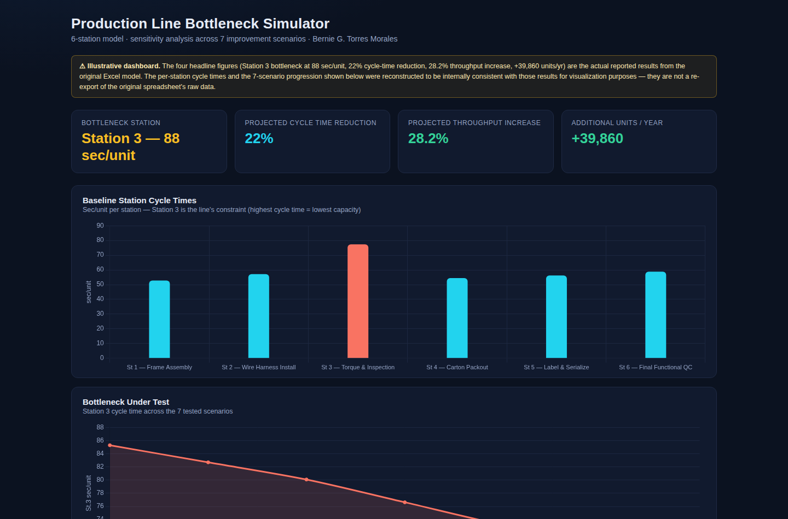

# Production Line Bottleneck Simulator

**[Live Demo →](https://whoistorres.github.io/production-line-bottleneck-simulator/)**

An interactive dashboard that visualizes a sensitivity analysis across 7 bottleneck-reduction scenarios for a 6-station production line — built as a portfolio visualization layer on top of a real independent Industrial Engineering project.

## What this is

The underlying project identified Station 3 (torque & inspection) as the constraining station on a 6-station line, and modeled a set of process interventions to reduce its cycle time and raise line throughput. This dashboard turns those results into something a reader can explore interactively, rather than a static chart in a report.

Pick any of the 7 tested scenarios from the dropdown and the throughput chart, the results table, and a plain-language summary line all update together to show that scenario's cycle time, throughput gain, and projected annual output versus the baseline.

## Key numbers

- **Station 3 bottleneck:** 88 sec/unit (baseline)
- **Projected cycle-time reduction:** 22%
- **Projected throughput increase:** 28.2%
- **Additional annual output:** +39,860 units/yr

These four figures are the actual reported results from the original Excel-based analysis.

## A note on the data

The four headline figures above are real. The per-station cycle times, the 6 intermediate scenarios, and the annual-operating-hours figure used to project yearly output are a **reconstructed, illustrative model** built to be internally consistent with those results — not a re-export of the original spreadsheet's raw data. The dashboard's own disclosure banner states this explicitly, and it's called out here for the same reason: the goal of this project is to demonstrate the analysis and communication, not to pass off illustrative numbers as raw source data.

## Features

- **Interactive scenario selector** — cross-highlights the throughput chart, the results table, and a dynamic summary line together
- **6 chart panels** — baseline station cycle times, the bottleneck's improvement path across scenarios, per-scenario throughput, and a before/after annual output comparison
- **Fully responsive** — reflows cleanly from a 6" phone screen up to a wide monitor, tested at multiple breakpoints
- **Zero dependencies at runtime** — Chart.js is embedded directly in the HTML file, so the page loads and renders completely offline, with no CDN or network call required

## Tech stack

Plain HTML, CSS, and vanilla JavaScript, with [Chart.js](https://www.chartjs.org/) embedded inline. No build step, no framework, no package manager required to run it.

## Running it locally

Download `index.html` and open it directly in any browser — that's it. There's no server or build process involved.

## Background

This dashboard was built on top of a real independent Industrial Engineering line-balancing project analyzing a 6-station production line. For questions about the underlying analysis, see the disclosure banner in the live dashboard.

---

*Bernie G. Torres Morales*
